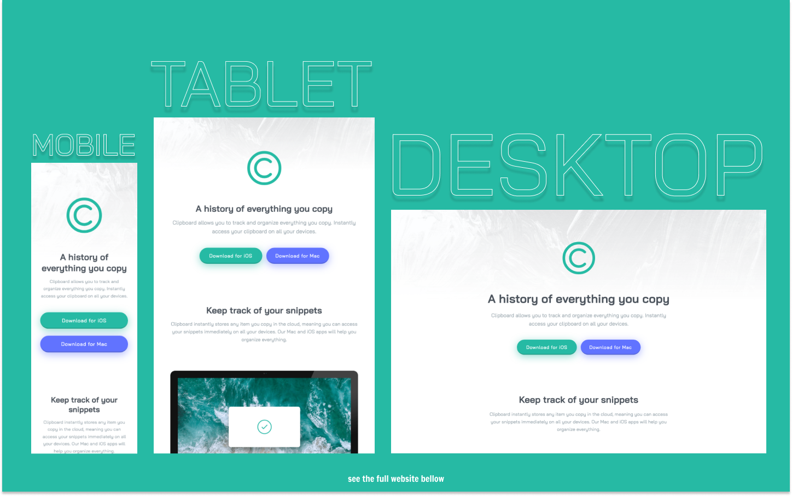

# Frontend Mentor - Clipboard Landing Page Solution

This is a solution to the [Clipboard Landing Page Challenge on Frontend Mentor](https://www.frontendmentor.io/challenges/clipboard-landing-page-5cc9bccd6c4c91111378ecb9).

## Table of contents

- [Overview](#overview)
  - [The challenge](#the-challenge)
  - [Screenshot](#screenshot)
  - [Links](#links)
- [My process](#my-process)
  - [Built with](#built-with)
  - [What I learned](#what-i-learned)
  - [Useful resources](#useful-resources)
- [Author](#author)

## Overview

### The challenge

Users should be able to:

- View the optimal layout for the site depending on their device's screen size
- See hover states for all interactive elements on the page

### Screenshot

### Links

- Live Site URL: [https://kens-visuals.github.io/clipboard-landing-page/](https://kens-visuals.github.io/clipboard-landing-page/)
- Solution URL: [TO_BE_UPDATED](TO_BE_UPDATED)

## My process

### Built with

- Semantic HTML5 markup
- SCSS custom properties
- CSS Flexbox
- CSS Grid
- Vanilla JS
- Mobile-first workflow

### What I learned

I liked the layout of this project, it was pretty simple and had a lot of white space, which is one of my favorite aspects in web design. I didn't necessarily learn much, I should say that I practiced more. I practice more on scroll-in animations with JS. Again, nothing crazy, I just thought this is another great opportunity to practice some new skills and build a good fundamental knowledge about them with these simple projects.

### Useful resources

- [The Auto Slider Animation](https://codepen.io/kens-visuals/pen/gOGxpmJ?editors=1100) - Check ot my CodePen to see how I did the logos' slider animation.

## Author

- Frontend Mentor - [@kens-visuals](https://www.frontendmentor.io/profile/kens-visuals)
- Codewars - [@kens_visuals](https://www.codewars.com/users/kens_visuals)
- CodePen - [@kens-visuals](https://codepen.io/kens-visuals)
